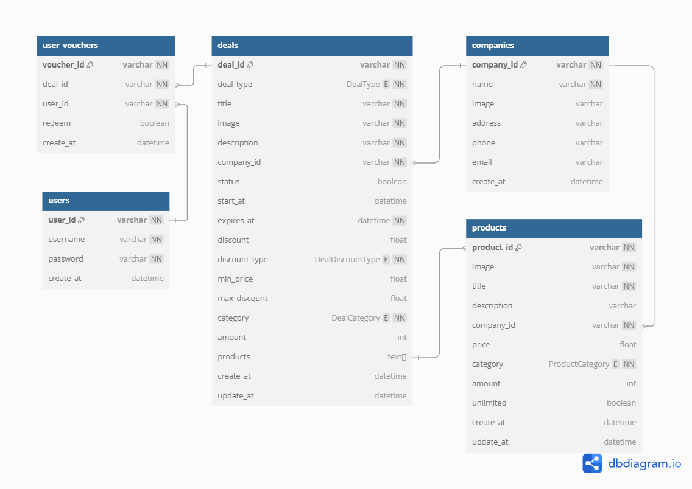

# 🐾 GOOK GOOK

ยินดีต้อนรับสู่ **GOOK GOOK** — a platform 🐶🐱

---

## ✨ Features

- 🛍️ **เรียกดูดีล**
  ผู้ใช้งานสามารถเรียกดูดีลทั้งหมดที่ร้านค้าพาร์ทเนอร์นำเสนอ

- 📄 **ดูรายละเอียดดีล**
  แสดงข้อมูลครบถ้วน เช่น รายละเอียด และเงื่อนไข

- 🎟️ **รับสิทธิ์คูปอง**
  ผู้ใช้งานสามารถแลกรับดีลผ่านแอปได้ทันที

- 🐾 **เน้นบริการสัตว์เลี้ยง**
  ครอบคลุมทั้งอาหาร อุปกรณ์ และบริการสำหรับสัตว์เลี้ยง

---

## 🧱 Tech Stack

- **Backend**: NestJS + MongoDB
- **ORM**: Mongoose
- **Schema Language**: TypeScript Decorators
- **Diagram Tool**: DBML + dbdiagram.io

---

## 📊 ER Diagram

---

## 🗃️ Database Schema

### 🏢 Companies

| Field      | Type   | Description |
| ---------- | ------ | ----------- |
| company_id | string | Unique ID   |
| name       | string | ชื่อบริษัท  |
| address    | string | ที่อยู่     |
| phone      | string | เบอร์โทร    |
| email      | string | email       |
| create_at  | Date   | วันที่สร้าง |

### 💼 Deals

| Field         | Type      | Description            |
| ------------- | --------- | ---------------------- |
| deal_id       | string    | Unique ID              |
| deal_type     | enum      | ประเภท กดรับ/รอรับ     |
| title         | string    | หัวข้อ                 |
| image         | string    | ภาพประกอบ              |
| description   | string    | คำอธิบาย               |
| company_id    | string    | บริษัท                 |
| status        | boolean   | สถานะเปิดใช้งาน        |
| start_at      | Date      | วันเริ่มใช้งาน         |
| expires_at    | Date      | วันหมดอายุ             |
| discount      | number    | ส่วนลด                 |
| discount_type | enum      | ประเภทส่วนลด บาท/%/ฟรี |
| min_price     | number    | จ่ายขั้นต่ำ            |
| max_discount  | number    | ลดได้มากสุด            |
| category      | enum      | ประเภทดีล              |
| amount        | number    | จำนวนสิทธิ             |
| products      | string\[] | List สินค้าที่ใช้ได้   |
| create_at     | Date      | วันที่สร้าง            |
| update_at     | Date      | วันที่อัพเดท           |

### 📦 Products

| Field       | Type    | Description          |
| ----------- | ------- | -------------------- |
| product_id  | string  | Unique ID            |
| image       | string  | ภาพประกอบ            |
| title       | string  | ชื่อสินค้าหรือบริการ |
| description | string  | คำอธิบาย             |
| company_id  | string  | บริษัท               |
| price       | number  | ราคา                 |
| category    | enum    | ประเภทสินค้า         |
| amount      | number  | จำนวนสินค้า          |
| unlimited   | boolean | มีไม่จำกัดไหม        |
| create_at   | Date    | วันที่สร้าง          |
| update_at   | Date    | วันที่อัพเดท         |

### 👤 Users

| Field     | Type   | Description      |
| --------- | ------ | ---------------- |
| user_id   | string | Unique ID        |
| username  | string | Required, Unique |
| password  | string | Required         |
| create_at | Date   | วันที่สร้าง      |

### 🎫 User Vouchers

| Field      | Type    | Description      |
| ---------- | ------- | ---------------- |
| voucher_id | string  | Unique ID        |
| deal_id    | string  | ID ดีลที่รับ     |
| user_id    | string  | ID user ที่รับ   |
| redeem     | boolean | ใช้ไปแล้วหรือยัง |
| create_at  | Date    | วันที่สร้าง      |

